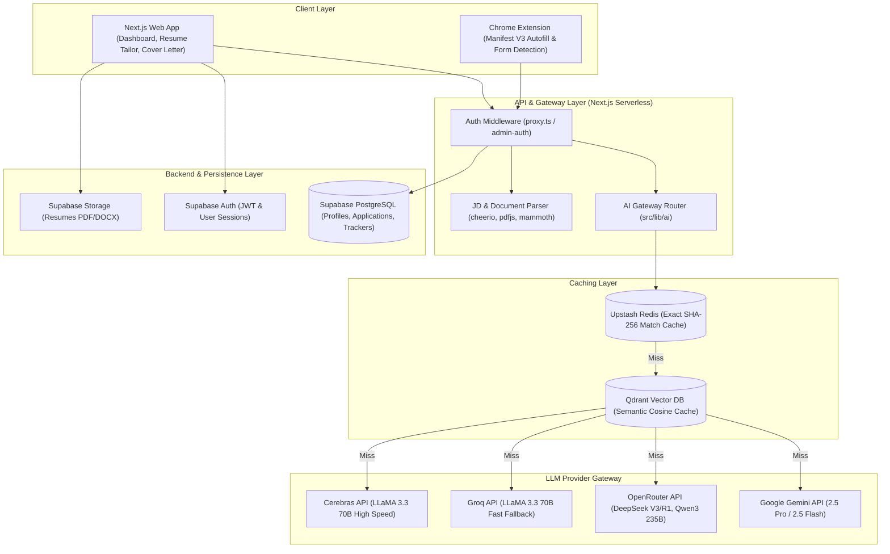
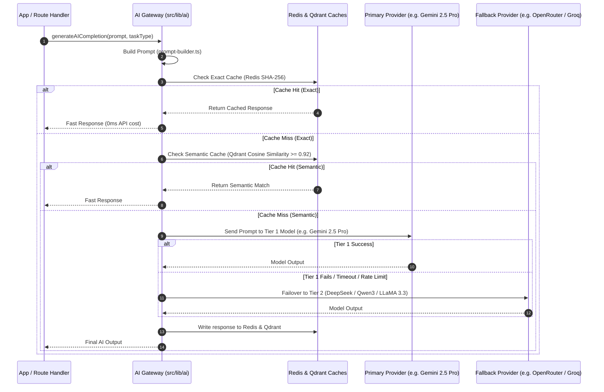
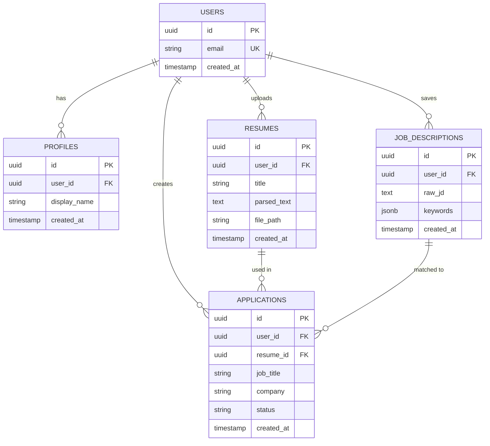

# System Architecture — ApplyX AI (`jobapply-ai`)

This document describes the high-level system architecture, data flow, component layout, and multi-model AI gateway design of **ApplyX AI**.

---

## 1. High-Level Architecture Overview

ApplyX AI is built as a modern, decoupled web application and browser extension ecosystem designed to automate and optimize job applications for job seekers.



---

## 2. Core Subsystems & Components

### 2.1 Web Application (Frontend)
- **Framework:** Next.js 16 (App Router), React 19, TypeScript
- **Styling:** Tailwind CSS v4, Radix UI primitives, Lucide React icons
- **Key Modules (`src/app`):**
  - `(dashboard)/dashboard`: Overview metrics and user job search analytics.
  - `(dashboard)/resumes`: Upload, parse, and manage master resume profiles.
  - `(dashboard)/tailor`: AI-powered ATS resume customization based on Job Descriptions.
  - `(dashboard)/cover-letters`: Personalised cover letter generator.
  - `(dashboard)/analyze`: ATS keyword extraction & job posting analysis.
  - `(dashboard)/applications`: Kanban board for application tracking (Saved → Applied → Interview → Offer → Rejected).
  - `i18n`: Internationalization module supporting English and Hindi.

### 2.2 Chrome Extension (Manifest V3)
- **Location:** `/extension`
- **Manifest:** Manifest V3 (`extension/manifest.json`)
- **Components:**
  - `content.js`: DOM analyzer and auto-filler for job portals (LinkedIn, Indeed, Naukri, Glassdoor, Lever, Greenhouse).
  - `popup.html` / `popup.js`: Extension interface for profile selection and instant field triggering.
  - `background.js`: Service worker managing background events and storage synchronization with the web app.

### 2.3 Backend Services & Persistence (Supabase)
- **Authentication:** Supabase Auth for user authentication and session management.
- **Database:** Supabase PostgreSQL storing:
  - User master profiles and parsed resume sections.
  - Application tracker states and historical application logs.
  - Tailored resumes and cover letters.
- **Storage:** Supabase Storage bucket for PDF/DOCX files.

---

## 3. Multi-Model AI Gateway Architecture

The AI subsystem (`src/lib/ai`) uses an intelligent task-based routing architecture with dynamic fallback chains and multi-level prompt caching.



### 3.1 Task-Based Model Routing Table

The system defines specialized routing chains per task type in [`src/lib/ai/config.ts`](file:///c:/Users/sony/OneDrive/Desktop/ApplyX%20AI/jobapply-ai/src/lib/ai/config.ts):

| Task Type | Primary Model (Tier 1) | Secondary Models (Tier 2/3) | Fallback Net (Tier 4/5) |
|---|---|---|---|
| **Resume Tailoring** (`resume`) | Gemini 2.5 Pro | DeepSeek V3, Qwen3 235B | Meta LLaMA 3.3 (70B), Gemini 2.5 Flash |
| **Cover Letter** (`cover-letter`) | Gemini 2.5 Pro | Qwen3 235B, DeepSeek V3 | Meta LLaMA 3.3 (70B), Gemini 2.5 Flash |
| **Job Analysis** (`analyze`) | Gemini 2.5 Pro | DeepSeek R1 (Reasoning), DeepSeek V3 | Meta LLaMA 3.3 (70B), Gemini 2.5 Flash |
| **General** (`general`) | Gemini 2.5 Pro | DeepSeek V3 | Meta LLaMA 3.3 (70B), Gemini 2.5 Flash |

### 3.2 Multi-Level Prompt Caching

1. **Exact-Match Cache (Upstash Redis):**
   - Hashing: SHA-256 key constructed from normalized, lowercased prompt string.
   - Response time: < 10ms.
   - TTL: 24 Hours.

2. **Semantic Cache (Qdrant Vector DB):**
   - Distance Metric: Cosine Similarity.
   - Threshold: `>= 0.92`.
   - Allows near-identical or rephrased prompts to avoid redundant LLM invocations.

---

## 4. File & Project Directory Layout

```
jobapply-ai/
├── extension/                  # Chrome Extension Manifest V3
│   ├── manifest.json
│   ├── background.js           # Background service worker
│   ├── content.js              # DOM field autofill script
│   └── popup.html / popup.js   # Extension popup UI
├── src/
│   ├── app/
│   │   ├── (dashboard)/        # Main app features (resumes, tailor, cover-letters, analyze, applications)
│   │   ├── api/
│   │   │   ├── ai/             # Unified AI Gateway endpoint
│   │   │   ├── fetch-jd/       # Job description web scraper
│   │   │   └── admin/          # Admin config endpoints
│   │   └── auth/               # Supabase auth callbacks
│   ├── lib/
│   │   ├── ai/                 # Core AI Gateway System
│   │   │   ├── config.ts       # Model routing table & feature flags
│   │   │   ├── router.ts       # Failover and provider execution logic
│   │   │   ├── providers.ts    # Direct HTTP clients for Gemini, OpenRouter, Groq, Cerebras
│   │   │   ├── prompt-builder.ts # Context injection & system instruction builder
│   │   │   └── cache.ts        # Redis (Exact) and Qdrant (Semantic) caching engine
│   │   ├── i18n/               # Multi-language dictionary (en, hi)
│   │   ├── profile-store.ts    # Supabase profile synchronization
│   │   └── resume-parser.ts    # PDF / DOCX file text extraction engine
│   └── proxy.ts                # Route protection middleware
├── public/                     # Static web assets
├── litellm_config.yaml         # LiteLLM standalone proxy configuration (optional)
├── vercel.json                 # Vercel deployment configuration
├── README.md                   # Project overview & quickstart guide
└── ARCHITECTURE.md             # Detailed system architecture (This document)
```

---

## 5. Security & Reliability Principles

### 5.1 Graceful Provider Fallback
Missing API keys do not cause errors; providers without valid API keys are skipped dynamically in the execution chain. See Section 3.1 for task-based routing fallbacks.

### 5.2 Zero-Trust Client Keys
All AI model provider API keys (`GEMINI_API_KEY`, `OPENROUTER_API_KEY`, `GROQ_API_KEY`, `CEREBRAS_API_KEY`) are:
- Stored **only in `.env.local`** — server-side, never committed to git.
- Used **only in `/api/` routes** running on Vercel's backend.
- **Never** passed to the browser bundle or referenced in any client-side component.

**Why this matters:** If someone obtains `NEXT_PUBLIC_SUPABASE_ANON_KEY`, they get read-only access to their own data (RLS prevents cross-user access). They can **never** steal AI provider keys to make unauthorized requests, because those keys never leave the server.

### 5.3 Data Privacy & Isolation
User data is protected at two independent levels:

1. **Database Level (RLS):** Supabase automatically enforces `WHERE user_id = auth.uid()` on all queries — see Section 6.2.
2. **Application Level:** All route handlers verify the user's identity via auth middleware before any query — see Section 7.1.

Even if the application-level check were bypassed, RLS acts as the final safety net at the database engine level.

### 5.4 Rate Limiting
All AI endpoints enforce per-user rate limits to prevent abuse and API key exhaustion:
- Resume tailoring: **10 requests/hour**
- Cover letter generation: **5 requests/hour**
- Job analysis: **20 requests/hour**

See Section 7.2 for implementation details.

### 5.5 Error Monitoring (Recommended)
Production deployments should log errors to **Sentry** for real-time alerts on:
- AI provider failures (timeouts, rate limits, invalid responses)
- Database errors (connection failures, slow queries)
- Auth failures (invalid tokens, expired sessions)
- Unexpected 5xx errors across all API routes

---

## 6. Data Security & Isolation

### 6.1 Database Schema with User Ownership

All tables in Supabase PostgreSQL include a `user_id` column referencing the authenticated user, enforcing ownership at the data model level:

```sql
-- Users (managed by Supabase Auth automatically)
-- Built-in: id (UUID PK), email, created_at

CREATE TABLE profiles (
  id          UUID PRIMARY KEY DEFAULT gen_random_uuid(),
  user_id     UUID NOT NULL REFERENCES auth.users(id) ON DELETE CASCADE,
  display_name TEXT,
  created_at  TIMESTAMP DEFAULT NOW()
);

CREATE TABLE resumes (
  id          UUID PRIMARY KEY DEFAULT gen_random_uuid(),
  user_id     UUID NOT NULL REFERENCES auth.users(id) ON DELETE CASCADE,
  title       TEXT NOT NULL,
  file_path   TEXT,        -- Supabase Storage path (private bucket)
  parsed_text TEXT,        -- Extracted resume content
  created_at  TIMESTAMP DEFAULT NOW()
);

CREATE TABLE applications (
  id          UUID PRIMARY KEY DEFAULT gen_random_uuid(),
  user_id     UUID NOT NULL REFERENCES auth.users(id) ON DELETE CASCADE,
  resume_id   UUID REFERENCES resumes(id) ON DELETE SET NULL,
  job_title   TEXT,
  company     TEXT,
  status      TEXT,        -- 'saved' | 'applied' | 'interview' | 'offer' | 'rejected'
  created_at  TIMESTAMP DEFAULT NOW()
);

CREATE TABLE job_descriptions (
  id          UUID PRIMARY KEY DEFAULT gen_random_uuid(),
  user_id     UUID NOT NULL REFERENCES auth.users(id) ON DELETE CASCADE,
  raw_jd      TEXT,
  keywords    JSONB,       -- Extracted ATS keywords
  created_at  TIMESTAMP DEFAULT NOW()
);
```

### Database Relationships (ER Diagram)



> **Key:** Every table has `user_id FK` pointing to Supabase Auth's `users` table. RLS policies enforce user isolation at the database engine level — no application code can accidentally bypass this.

### 6.2 Row-Level Security (RLS) Policies

**All user data tables enforce RLS at the database level. A user can only access rows where `user_id = auth.uid()`:**

```sql
-- Enable RLS on all tables
ALTER TABLE profiles         ENABLE ROW LEVEL SECURITY;
ALTER TABLE resumes          ENABLE ROW LEVEL SECURITY;
ALTER TABLE applications     ENABLE ROW LEVEL SECURITY;
ALTER TABLE job_descriptions ENABLE ROW LEVEL SECURITY;

-- Profiles: users see and manage only their own profile
CREATE POLICY "Users see own profile"    ON profiles FOR SELECT USING (auth.uid() = user_id);
CREATE POLICY "Users update own profile" ON profiles FOR UPDATE USING (auth.uid() = user_id) WITH CHECK (auth.uid() = user_id);

-- Resumes: full CRUD scoped to owner
CREATE POLICY "Users see own resumes"    ON resumes FOR SELECT USING (auth.uid() = user_id);
CREATE POLICY "Users insert own resumes" ON resumes FOR INSERT WITH CHECK (auth.uid() = user_id);
CREATE POLICY "Users update own resumes" ON resumes FOR UPDATE USING (auth.uid() = user_id) WITH CHECK (auth.uid() = user_id);
CREATE POLICY "Users delete own resumes" ON resumes FOR DELETE USING (auth.uid() = user_id);

-- Applications: full CRUD scoped to owner
CREATE POLICY "Users see own applications"    ON applications FOR SELECT USING (auth.uid() = user_id);
CREATE POLICY "Users insert own applications" ON applications FOR INSERT WITH CHECK (auth.uid() = user_id);
CREATE POLICY "Users update own applications" ON applications FOR UPDATE USING (auth.uid() = user_id) WITH CHECK (auth.uid() = user_id);
CREATE POLICY "Users delete own applications" ON applications FOR DELETE USING (auth.uid() = user_id);

-- Job Descriptions: full CRUD scoped to owner
CREATE POLICY "Users see own JDs"    ON job_descriptions FOR SELECT USING (auth.uid() = user_id);
CREATE POLICY "Users insert own JDs" ON job_descriptions FOR INSERT WITH CHECK (auth.uid() = user_id);
CREATE POLICY "Users update own JDs" ON job_descriptions FOR UPDATE USING (auth.uid() = user_id) WITH CHECK (auth.uid() = user_id);
CREATE POLICY "Users delete own JDs" ON job_descriptions FOR DELETE USING (auth.uid() = user_id);
```

**Impact:** Even if someone obtains `NEXT_PUBLIC_SUPABASE_ANON_KEY`, they can only query/modify rows they own. The PostgreSQL engine itself enforces isolation before returning any data.

### 6.3 Data Privacy in Transit

- All API endpoints use **HTTPS only** — enforced by Vercel at the edge.
- User session tokens are stored in **`httpOnly`, `Secure`, `SameSite=Strict` cookies** — inaccessible to JavaScript, preventing XSS token theft.
- Resume files in Supabase Storage are in **private buckets** — clients must authenticate via Supabase Auth to generate a signed URL before accessing.

---

## 7. API Security & Rate Limiting

### 7.1 Authentication Middleware (`proxy.ts`)

All protected routes (`/api/ai/*`, `/api/fetch-jd/*`, `/(dashboard)/*`) pass through the Next.js middleware which:

1. **Extracts session:** Verifies the JWT token from the request cookie.
2. **Validates user:** Confirms the user exists and is authenticated in Supabase.
3. **Injects context:** Adds `x-user-id` header to the request for use in route handlers.

```typescript
// src/proxy.ts (simplified)
import { createMiddlewareClient } from '@supabase/auth-helpers-nextjs';

export async function middleware(request: NextRequest) {
  const response = NextResponse.next();
  const supabase = createMiddlewareClient({ req: request, res: response });
  const { data: { user }, error } = await supabase.auth.getUser();

  // Unauthenticated — redirect to login
  if (!user || error) {
    return NextResponse.redirect(new URL('/auth/login', request.url));
  }

  // Inject verified user ID into request headers for route handlers
  const requestHeaders = new Headers(request.headers);
  requestHeaders.set('x-user-id', user.id);
  return NextResponse.next({ request: { headers: requestHeaders } });
}

export const config = {
  matcher: [
    '/api/ai/:path*',
    '/api/fetch-jd/:path*',
    '/(dashboard)/:path*',
  ],
};
```

### 7.2 Per-User Rate Limiting

Each AI feature endpoint enforces independent sliding-window rate limits via **Upstash Ratelimit SDK**:

```typescript
// src/lib/rate-limiter.ts
import { Ratelimit } from '@upstash/ratelimit';
import { Redis } from '@upstash/redis';

const redis = Redis.fromEnv();

export const limiter = {
  // Resume tailoring: 10 requests/hour per user
  tailorResume: new Ratelimit({
    redis,
    limiter: Ratelimit.slidingWindow(10, '1 h'),
    analytics: true,
  }),
  // Cover letter: 5 requests/hour per user
  coverLetter: new Ratelimit({
    redis,
    limiter: Ratelimit.slidingWindow(5, '1 h'),
    analytics: true,
  }),
  // Job analysis: 20 requests/hour per user
  analyzeJob: new Ratelimit({
    redis,
    limiter: Ratelimit.slidingWindow(20, '1 h'),
    analytics: true,
  }),
};

// Usage pattern in every /api/ai/... route handler
export async function POST(req: NextRequest) {
  const userId = req.headers.get('x-user-id'); // Injected by middleware

  const { success, retryAfter } = await limiter.tailorResume.limit(userId!);
  if (!success) {
    return NextResponse.json(
      { error: `Rate limit exceeded. Retry after ${Math.ceil(retryAfter / 1000)}s` },
      { status: 429, headers: { 'Retry-After': String(Math.ceil(retryAfter / 1000)) } }
    );
  }

  // Safe to proceed — call AI gateway with server-side keys
}
```

### 7.3 Secret Key Isolation

**Environment variable classification:**

| Variable | Prefix | Exposed To | Purpose |
|---|---|---|---|
| `NEXT_PUBLIC_SUPABASE_URL` | `NEXT_PUBLIC_` | Browser + Server | Supabase project URL |
| `NEXT_PUBLIC_SUPABASE_ANON_KEY` | `NEXT_PUBLIC_` | Browser + Server | Supabase public anon key (RLS-protected) |
| `GEMINI_API_KEY` | *(none)* | **Server only** | Gemini AI calls |
| `OPENROUTER_API_KEY` | *(none)* | **Server only** | OpenRouter AI calls |
| `GROQ_API_KEY` | *(none)* | **Server only** | Groq AI calls |
| `CEREBRAS_API_KEY` | *(none)* | **Server only** | Cerebras AI calls |
| `UPSTASH_REDIS_REST_URL` | *(none)* | **Server only** | Redis prompt caching |
| `UPSTASH_REDIS_REST_TOKEN` | *(none)* | **Server only** | Redis authentication |
| `SUPABASE_SERVICE_ROLE_KEY` | *(none)* | **Server only** | Admin DB operations (bypasses RLS) |

> **Rule:** If a variable name does NOT start with `NEXT_PUBLIC_`, it is **server-side only**. Next.js strips these from the client bundle at build time. They are never reachable from DevTools, the browser network tab, or client-side JavaScript.

### 7.4 Chrome Extension Authentication

The extension re-verifies the user's session server-side before every autofill operation. It does not cache or trust locally stored credentials:

```javascript
// extension/background.js
chrome.runtime.onMessage.addListener((message, sender, sendResponse) => {
  if (message.type === 'AUTOFILL_REQUEST') {
    // Step 1: Re-verify session server-side before fetching profile
    fetch(`${BACKEND_URL}/api/auth/verify`, {
      method: 'GET',
      credentials: 'include', // Send httpOnly auth cookie
    })
    .then(res => res.json())
    .then(data => {
      if (!data.authenticated) {
        // Notify user to re-login — block autofill
        chrome.notifications.create({
          type: 'basic',
          title: 'ApplyX AI — Session Expired',
          message: 'Please log in again to use autofill.',
        });
        sendResponse({ error: 'Unauthenticated' });
        return;
      }
      // Step 2: Fetch profile with verified session
      return fetchUserProfile(data.userId);
    })
    .then(profile => sendResponse({ success: true, profile }))
    .catch(() => sendResponse({ error: 'Auth check failed' }));

    return true; // Keep message channel open for async response
  }
});
```

If the session is expired, the extension **blocks the autofill** and shows a re-login notification rather than silently failing or sending stale data.
