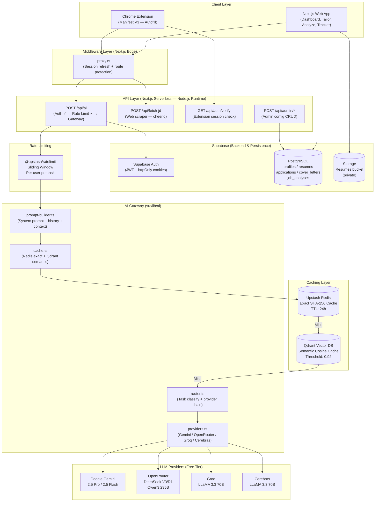
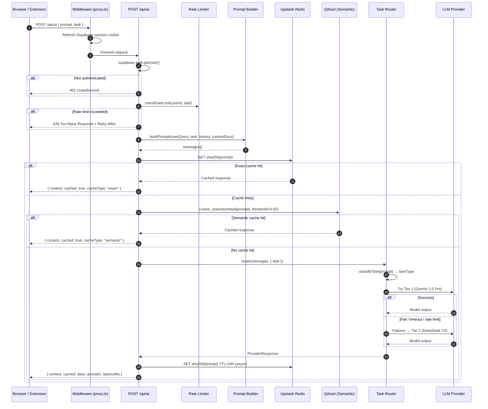
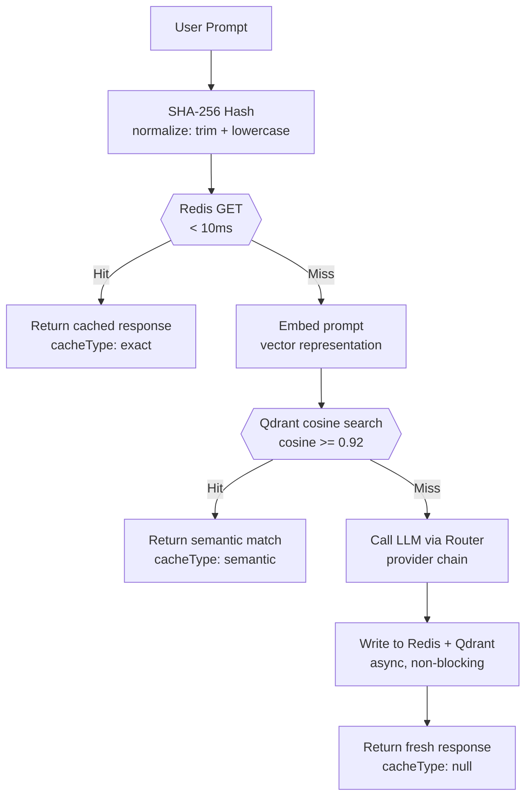
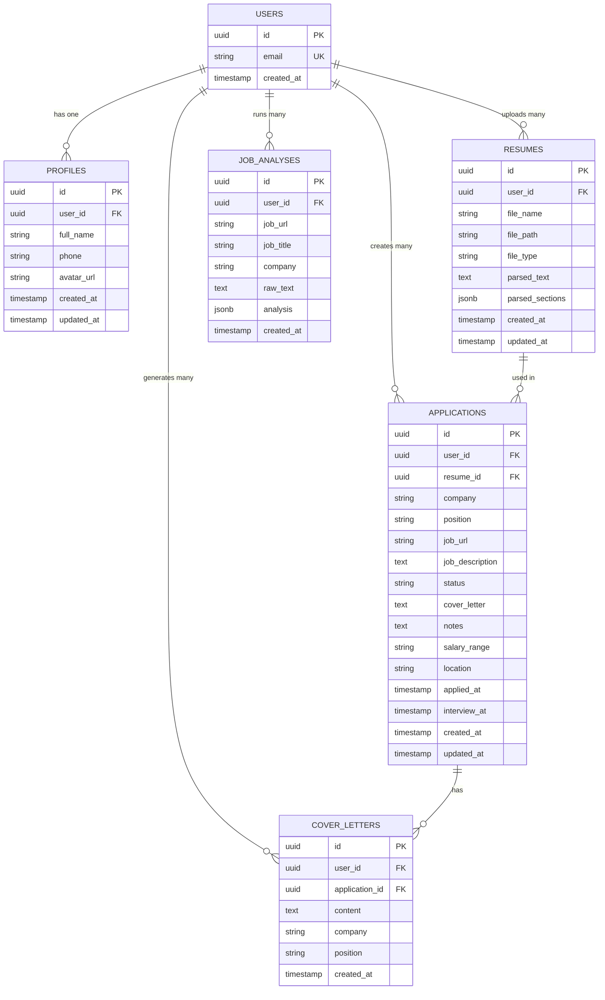
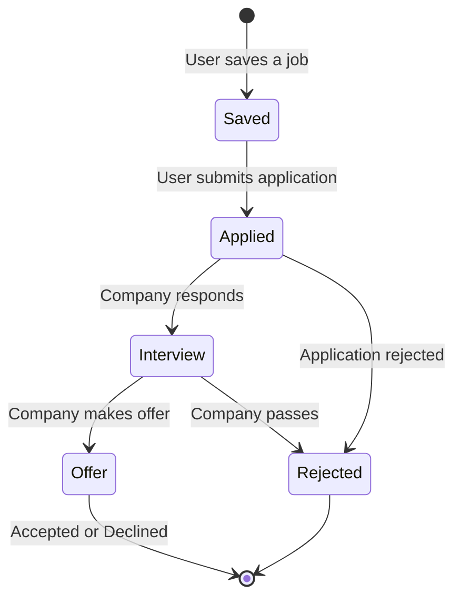
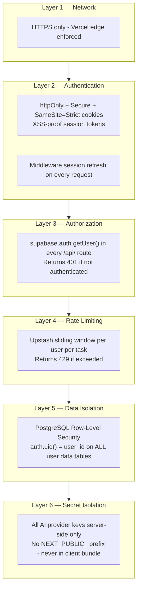
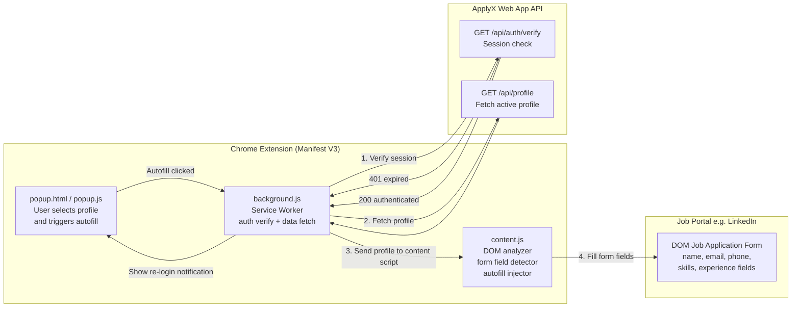
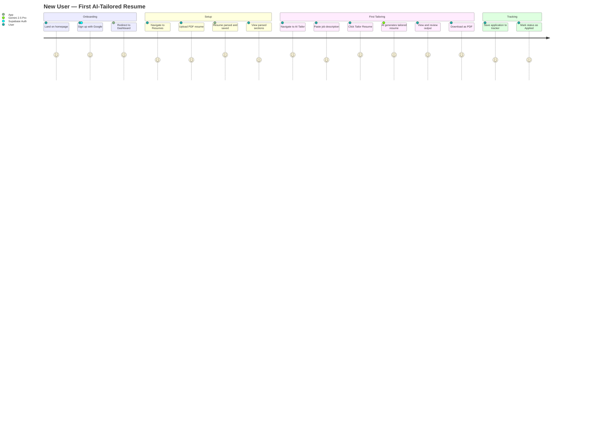
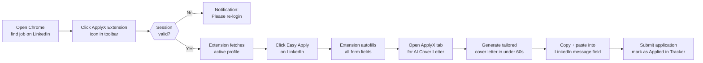

# Product Requirements Document (PRD)
## ApplyX AI — India's AI-Powered Job Application Assistant

**Version:** 2.0  
**Last Updated:** August 2026  
**Status:** Active Development  

---

## Table of Contents

1. [Product Overview](#1-product-overview)
2. [Problem Statement](#2-problem-statement)
3. [Target Users & Personas](#3-target-users--personas)
4. [Product Goals & Success Metrics](#4-product-goals--success-metrics)
5. [Feature Requirements](#5-feature-requirements)
6. [System Architecture](#6-system-architecture)
7. [Multi-Model AI Gateway](#7-multi-model-ai-gateway)
8. [Database Design](#8-database-design)
9. [Security Architecture](#9-security-architecture)
10. [API Surface](#10-api-surface)
11. [Chrome Extension](#11-chrome-extension)
12. [User Journeys](#12-user-journeys)
13. [Non-Functional Requirements](#13-non-functional-requirements)
14. [Tech Stack](#14-tech-stack)
15. [Release Roadmap](#15-release-roadmap)

---

## 1. Product Overview

**ApplyX AI** is an AI-powered job application assistant built specifically for the Indian job market. It helps job seekers dramatically reduce the time and effort required to apply for jobs by automating resume tailoring, cover letter generation, job posting analysis, form autofill, and application tracking — all using free-tier AI models with intelligent routing and fallback.

> **Tagline:** *Apply smarter. Get hired faster.*

### Core Value Proposition

| Without ApplyX AI | With ApplyX AI |
|---|---|
| 45–90 min per application | < 10 min per application |
| Generic resumes for every role | ATS-optimized, role-specific resumes |
| Manual form filling on every portal | One-click Chrome Extension autofill |
| No visibility into ATS match | Real-time ATS keyword gap analysis |
| Scattered notes and spreadsheets | Unified Kanban application tracker |

---

## 2. Problem Statement

Indian job seekers face a uniquely challenging landscape:

- **Volume pressure:** Top companies in India receive 50,000–200,000+ applications per opening. Candidates must apply in bulk to compete.
- **ATS gatekeeping:** 75%+ of resumes are filtered out by Applicant Tracking Systems before a human sees them.
- **Resume fatigue:** Tailoring a resume for each job takes 45–90 minutes, making high-volume applications unsustainable.
- **Information asymmetry:** Most candidates don't know which keywords the ATS is looking for, or how to address them.
- **Cost barrier:** Premium tools like Rezi, Jobscan, and Resume Worded charge ₹2,000–₹5,000/month — out of reach for most freshers and mid-career professionals.

**ApplyX AI solves all of these** — for free at the core tier — by combining multiple free-tier AI APIs under a single intelligent gateway.

---

## 3. Target Users & Personas

### Persona 1: The Fresh Graduate — "Priya, 22"
- **Background:** B.Tech from a Tier-2 college, applying to 50+ companies simultaneously
- **Pain:** Can't afford premium tools; sends the same generic resume everywhere; getting no callbacks
- **Goal:** Land a first job at a product startup or IT services company within 3 months
- **ApplyX use case:** Upload resume once, tailor it for each JD in minutes, track all applications

### Persona 2: The Career Switcher — "Rahul, 29"
- **Background:** 5 years in operations, wants to move into product management
- **Pain:** His resume doesn't speak PM language; keeps getting rejected at ATS stage
- **Goal:** Reframe his experience into PM-relevant bullet points with quantified impact
- **ApplyX use case:** AI Resume Tailor + Job Analysis to identify and close skill gaps

### Persona 3: The Active Applicant — "Ananya, 26"
- **Background:** Software engineer, 3 YOE, actively looking, applying on LinkedIn, Naukri, Glassdoor simultaneously
- **Pain:** Filling the same form on every portal wastes an hour per day
- **Goal:** Apply to 5x more jobs with same effort
- **ApplyX use case:** Chrome Extension autofill on every portal + Application Tracker

---

## 4. Product Goals & Success Metrics

### Primary Goals
1. Reduce average application time from 60 min → 10 min
2. Improve ATS pass rate for users' tailored resumes
3. Build a sustainable freemium business targeting 10,000 MAU within 6 months

### Key Metrics (KPIs)

| Metric | Target (Month 3) | Target (Month 6) |
|---|---|---|
| Monthly Active Users | 1,000 | 10,000 |
| Applications submitted via ApplyX | 5,000/month | 50,000/month |
| Free → Paid conversion rate | 3% | 5% |
| Average resume tailoring time | < 2 min AI gen | < 2 min AI gen |
| AI gateway uptime | > 99% | > 99.5% |
| Cache hit rate (prompt caching) | > 30% | > 50% |

---

## 5. Feature Requirements

### 5.1 Resume Parser
**Priority:** P0 (MVP)

- Upload PDF, DOCX, or TXT resume files
- Extract full text using `pdfjs-dist` (PDF) and `mammoth` (DOCX)
- Parse into sections: Summary, Experience, Education, Skills, Certifications
- Store parsed text and sections in Supabase (`resumes` table)
- Support multiple saved resumes per user (resume library)
- Mark one resume as "active" for use across all features

**Acceptance Criteria:**
- [ ] PDF and DOCX uploads parse correctly with >95% text extraction accuracy
- [ ] Files stored in private Supabase Storage bucket, accessible only by owner
- [ ] Parsed sections available within 3 seconds of upload

### 5.2 AI Resume Tailor
**Priority:** P0 (MVP)

- Input: User's active resume text + target Job Description (JD)
- Output: Fully rewritten, ATS-optimized resume in professional Markdown
- Uses STAR methodology (Situation/Task → Action → Quantified Result)
- Integrates exact ATS keywords from the JD naturally
- High-impact action verbs on every bullet point
- Routes to best available model: Gemini 2.5 Pro → DeepSeek V3 → Qwen3 235B → LLaMA 3.3 (70B)
- Downloadable as PDF using `jspdf` / `html2pdf.js`

**Acceptance Criteria:**
- [ ] Output includes all required resume sections
- [ ] All keywords from JD appear naturally in the tailored resume
- [ ] PDF export renders correctly
- [ ] Rate limit: 10 tailoring requests/hour per user

### 5.3 Cover Letter Generator
**Priority:** P0 (MVP)

- Input: Resume + JD + optional tone preference
- Output: Personalized, persuasive cover letter ready to submit
- Compelling opening hook tied to company mission
- Quantified achievements mapped to JD requirements
- ATS keyword integration
- Professional call-to-action closing

**Acceptance Criteria:**
- [ ] Cover letter length: 300–500 words
- [ ] Tailored to specific company and role (not generic)
- [ ] Rate limit: 5 requests/hour per user

### 5.4 Job Analysis & ATS Scoring
**Priority:** P0 (MVP)

- Input: Job posting URL or pasted text + resume
- Output: Structured analysis including:
  - ATS match score (0–100)
  - Matched keywords (green)
  - Missing keywords (red)
  - Skill gaps
  - Actionable recommendations with specific rewrite suggestions
- Uses DeepSeek R1 (reasoning model) for deep structural analysis
- JD text extraction via `cheerio` web scraper (`/api/fetch-jd`)

**Acceptance Criteria:**
- [ ] ATS score correlates meaningfully with actual keyword overlap
- [ ] Analysis includes at least 5 specific actionable recommendations
- [ ] Works with JDs from LinkedIn, Naukri, Glassdoor, Indeed, company career pages

### 5.5 Application Tracker
**Priority:** P0 (MVP)

- Kanban board with 5 stages: Saved → Applied → Interview → Offer → Rejected
- Fields per application: Company, Role, URL, Status, Date, Resume used, Cover letter, Notes, Salary range, Location
- Drag-and-drop stage transitions
- Filter and search across all applications
- Statistics: total applications, conversion rates per stage
- Persisted in Supabase `applications` table (RLS-protected)

**Acceptance Criteria:**
- [ ] Users can add, edit, delete, and move applications across stages
- [ ] Application data is private — RLS enforced
- [ ] Statistics update in real-time

### 5.6 Chrome Extension (Manifest V3)
**Priority:** P1

- Detects job application forms on major portals: LinkedIn, Indeed, Naukri, Glassdoor, Lever, Greenhouse, Workday, iCIMS
- Auto-fills form fields from the user's active profile (name, email, phone, LinkedIn, skills, experience)
- Re-verifies Supabase session server-side via `GET /api/auth/verify` before every autofill
- Shows notification if session is expired — blocks autofill until re-login
- Popup UI for profile selection and field triggering

**Acceptance Criteria:**
- [ ] Autofill works on LinkedIn Easy Apply, Naukri Quick Apply, Greenhouse, Lever
- [ ] Extension blocks autofill if session is expired (no silent failures)
- [ ] Profile data fetched securely server-side — no plaintext keys in extension bundle

### 5.7 Multi-language Support
**Priority:** P1

- English and Hindi supported via `src/lib/i18n/`
- One-click language toggle in the UI
- All UI strings externalised into language dictionaries
- AI output language follows the input prompt language

**Acceptance Criteria:**
- [ ] All dashboard UI text available in both languages
- [ ] Language preference persisted across sessions

### 5.8 Admin Panel
**Priority:** P2

- Database-driven AI configuration (no code deploys needed):
  - `ai_model_routes`: Edit provider fallback chains per task type
  - `ai_prompt_templates`: Edit system prompts with versioning
  - `ai_generation_policies`: Control temperature, max tokens, tone, length
- In-memory cache (60s TTL) for admin config — zero-downtime updates
- Protected by `admin-auth.ts` role check

---

## 6. System Architecture

### 6.1 High-Level Architecture



---

## 7. Multi-Model AI Gateway

### 7.1 Request Lifecycle — Sequence Diagram



### 7.2 Task-Based Model Routing Table

| Task | Tier 1 | Tier 2 | Tier 3 | Tier 4 | Tier 5 (Safety Net) |
|---|---|---|---|---|---|
| `resume` | Gemini 2.5 Pro | DeepSeek V3 | Qwen3 235B | LLaMA 3.3 70B (Groq) | Gemini 2.5 Flash |
| `cover-letter` | Gemini 2.5 Pro | Qwen3 235B | DeepSeek V3 | LLaMA 3.3 70B (Groq) | Gemini 2.5 Flash |
| `analyze` | Gemini 2.5 Pro | DeepSeek R1 | DeepSeek V3 | LLaMA 3.3 70B (Groq) | Gemini 2.5 Flash |
| `general` | Gemini 2.5 Pro | DeepSeek V3 | LLaMA 3.3 70B (Groq) | Cerebras LLaMA 3.3 | Gemini 2.5 Flash |

> Providers with no API key configured are **automatically skipped** — no errors, graceful degradation.

### 7.3 Prompt Caching Strategy



### 7.4 Provider Free Tier Summary

| Provider | Model | Free Quota | Speed | Best For |
|---|---|---|---|---|
| **Gemini** | Gemini 2.5 Pro | 15 req/min | Medium | Long context, quality |
| **Gemini** | Gemini 2.5 Flash | 15 req/min | Fast | Fallback safety net |
| **OpenRouter** | DeepSeek V3 | 50 req/day | Medium | Coding, general |
| **OpenRouter** | DeepSeek R1 | 50 req/day | Slow | Deep reasoning |
| **OpenRouter** | Qwen3 235B | 50 req/day | Medium | Writing quality |
| **Groq** | LLaMA 3.3 70B | 6,000 req/day | Very fast | Speed-sensitive tasks |
| **Cerebras** | LLaMA 3.3 70B | Free tier | Fastest | Ultra-low latency |

---

## 8. Database Design

### 8.1 Entity-Relationship Diagram



### 8.2 Application Status State Machine



### 8.3 Row-Level Security (RLS) Summary

All tables enforce `auth.uid() = user_id` at the PostgreSQL engine level.

| Table | SELECT | INSERT | UPDATE | DELETE |
|---|---|---|---|---|
| `profiles` | own only | — | own only | — |
| `resumes` | own only | own only | own only | own only |
| `applications` | own only | own only | own only | own only |
| `cover_letters` | own only | own only | own only | own only |
| `job_analyses` | own only | own only | — | own only |

---

## 9. Security Architecture

### 9.1 Defence-in-Depth Model



### 9.2 Environment Variable Classification

| Variable | Scope | Visible in Browser? |
|---|---|---|
| `NEXT_PUBLIC_SUPABASE_URL` | Public | Yes (intentional) |
| `NEXT_PUBLIC_SUPABASE_ANON_KEY` | Public (RLS-protected) | Yes (safe — RLS enforced) |
| `GEMINI_API_KEY` | Server only | Never |
| `OPENROUTER_API_KEY` | Server only | Never |
| `GROQ_API_KEY` | Server only | Never |
| `CEREBRAS_API_KEY` | Server only | Never |
| `UPSTASH_REDIS_REST_URL` | Server only | Never |
| `UPSTASH_REDIS_REST_TOKEN` | Server only | Never |
| `SUPABASE_SERVICE_ROLE_KEY` | Server only | Never |

### 9.3 Per-User Rate Limits

| Endpoint | Limit | Window | Response on Exceed |
|---|---|---|---|
| `/api/ai` task=`resume` | 10 requests | 1 hour | `429` + `Retry-After` header |
| `/api/ai` task=`cover-letter` | 5 requests | 1 hour | `429` + `Retry-After` header |
| `/api/ai` task=`analyze` | 20 requests | 1 hour | `429` + `Retry-After` header |
| `/api/ai` task=`general` | 30 requests | 1 hour | `429` + `Retry-After` header |

---

## 10. API Surface

### 10.1 Endpoint Reference

| Method | Endpoint | Auth Required | Rate Limited | Description |
|---|---|---|---|---|
| `POST` | `/api/ai` | Yes | Yes | Unified AI gateway for all LLM calls |
| `POST` | `/api/fetch-jd` | Yes | — | Scrape job description from URL |
| `GET` | `/api/auth/verify` | Yes | — | Extension session verification |
| `GET/POST` | `/api/admin/*` | Admin only | — | Admin config CRUD |
| `POST` | `/api/groq` | Yes | — | Legacy — forwards to `/api/ai` |
| `POST` | `/api/gemini` | Yes | — | Legacy Gemini direct endpoint |

### 10.2 `/api/ai` Request & Response Schema

**Request:**
```typescript
{
  prompt: string;               // required — user's raw input
  task?: "resume" | "cover-letter" | "analyze" | "general";
  systemInstruction?: string;  // override default system prompt
  userApiKey?: string;         // user-supplied key (overrides server key)
  history?: Array<{ role: "user" | "assistant"; content: string }>;
  contextDocuments?: Array<{ label: string; content: string }>;
}
```

**Response (200):**
```typescript
{
  content: string;        // AI-generated text
  provider: string;       // "gemini" | "openrouter" | "groq" | "cerebras"
  model: string;          // specific model ID used
  displayName: string;    // human-readable model name
  cached: boolean;        // true if served from cache
  cacheType: "exact" | "semantic" | null;
  task: string;           // detected or provided task type
  latencyMs: number;      // total processing time in ms
}
```

**Error Responses:**
- `400` — Missing or invalid `prompt`
- `401` — Not authenticated
- `429` — Rate limit exceeded (includes `Retry-After` header)
- `500` — All AI providers failed

---

## 11. Chrome Extension

### 11.1 Extension Architecture



### 11.2 Supported Job Portals

| Portal | Autofill Support | Fields Covered |
|---|---|---|
| LinkedIn Easy Apply | Full | Name, email, phone, resume upload |
| Naukri Quick Apply | Full | All standard fields |
| Glassdoor | Partial | Name, email, phone |
| Indeed | Partial | Name, email, phone |
| Greenhouse | Full | Standard application fields |
| Lever | Full | Standard application fields |
| Workday | Planned | — |
| iCIMS | Planned | — |

---

## 12. User Journeys

### 12.1 First-Time User Journey



### 12.2 Returning User — Daily Workflow



---

## 13. Non-Functional Requirements

### 13.1 Performance

| Metric | Target |
|---|---|
| Cache hit response time | < 100ms |
| AI response time (Groq fallback) | < 5 seconds |
| AI response time (Gemini 2.5 Pro) | < 30 seconds |
| Page load (dashboard, LCP) | < 2 seconds |
| Extension autofill time after click | < 2 seconds |

### 13.2 Availability & Reliability

| Metric | Target |
|---|---|
| Web app uptime | > 99.5% (Vercel SLA) |
| AI gateway uptime | > 99% (multi-provider failover) |
| Database uptime | > 99.9% (Supabase SLA) |
| MTTR on AI provider failure | < 1 second (automatic failover) |

### 13.3 Scalability

- Stateless serverless functions scale independently on Vercel per route
- Redis caching reduces LLM calls by an estimated 30–50% at scale
- 4 independent LLM providers prevent single-point-of-failure
- Supabase connection pooling handles concurrent database connections

### 13.4 Privacy & Compliance

- All user data stored in Supabase with configurable region (EU/US)
- Resume files stored in private Supabase Storage — never publicly accessible
- No user PII sent to LLM providers in identifiable form
- GDPR-aligned: users can delete account and all associated data
- No tracking cookies beyond Supabase auth session

---

## 14. Tech Stack

| Layer | Technology | Version | Purpose |
|---|---|---|---|
| **Framework** | Next.js | 16.2.12 | Full-stack React framework |
| **UI Library** | React | 19.2.4 | Component rendering |
| **Language** | TypeScript | 5.x | Type safety |
| **Styling** | Tailwind CSS | v4 | Utility-first CSS |
| **Components** | Radix UI | ^1 | Accessible UI primitives |
| **Icons** | Lucide React | ^0 | Icon set |
| **Database** | Supabase PostgreSQL | — | User data, RLS |
| **Auth** | Supabase Auth | — | JWT sessions, httpOnly cookies |
| **Storage** | Supabase Storage | — | Resume files (private bucket) |
| **PDF Parsing** | pdfjs-dist | ^6.2.108 | Extract text from PDFs |
| **DOCX Parsing** | mammoth | ^1.12.0 | Extract text from Word docs |
| **Web Scraping** | cheerio | ^1.2.0 | JD extraction from URLs |
| **PDF Export** | jspdf + html2pdf.js | latest | Download tailored resumes |
| **Cache** | Upstash Redis | — | Exact-match prompt cache (24h TTL) |
| **Rate Limiting** | @upstash/ratelimit | latest | Per-user sliding window limits |
| **Semantic Cache** | Qdrant | — | Vector similarity cache (Phase 3) |
| **AI Gateway** | Custom (`src/lib/ai`) | — | Multi-provider routing + fallback |
| **LLM Providers** | Gemini, OpenRouter, Groq, Cerebras | — | Free-tier LLM inference |
| **Extension** | Chrome Manifest V3 | — | Browser autofill |
| **Deployment** | Vercel | — | Serverless hosting + edge network |
| **Markdown** | React Markdown | ^10.1.0 | Render AI output |

---

## 15. Release Roadmap

### Phase 1 — MVP (Current)
**Status: Complete**

- [x] Resume upload, parsing, and storage
- [x] AI Resume Tailor (multi-model gateway with 5-tier fallback)
- [x] Cover Letter Generator
- [x] Job Analysis & ATS Scoring
- [x] Application Tracker (Kanban)
- [x] Chrome Extension (core autofill)
- [x] Auth + RLS (all tables) + Rate Limiting
- [x] Multi-language (EN/HI)
- [x] Exact-match Redis prompt cache
- [x] Admin panel with DB-driven AI configuration

### Phase 2 — Growth (Next 60 Days)
**Status: Planned**

- [ ] Semantic cache (Qdrant integration — currently stubbed)
- [ ] Workday + iCIMS autofill support
- [ ] Resume version history and diff view
- [ ] Razorpay integration for paid tiers
- [ ] Analytics dashboard (applications/week, callback rate)
- [ ] Sentry error monitoring
- [ ] Email notifications on application status change

### Phase 3 — Scale (Month 3–6)
**Status: Backlog**

- [ ] Mobile app (React Native or PWA)
- [ ] AI interview preparation (mock Q&A by role)
- [ ] Salary benchmarking integration
- [ ] Company research assistant
- [ ] Referral system
- [ ] B2B: College placement cell dashboard (Enterprise tier)
- [ ] Job feed aggregator (Naukri + LinkedIn + Indeed unified search)

---

## Pricing Model

| Plan | Price | Resume Tailoring | Cover Letters | Analysis | Applications |
|---|---|---|---|---|---|
| **Free** | ₹0 | 5/month | 3/month | 10/month | Unlimited |
| **Basic** | ₹299/month | Unlimited | Unlimited | Unlimited | Unlimited |
| **Premium** | ₹599/month | Unlimited + Priority AI | Unlimited | Unlimited | Unlimited + Analytics |
| **Enterprise** | Custom | Multi-seat | Multi-seat | Team dashboards | College/Agency portal |

---

*This PRD reflects the current state of the codebase as of August 2026. All architecture diagrams are generated from the live implementation.*
