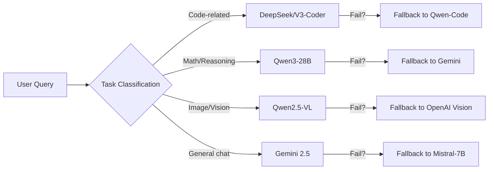

# Executive Summary

Modern **AI SaaS** platforms typically aggregate many LLMs behind a single gateway to optimize cost, latency, and reliability. This guide details a *production-ready* architecture for an Antigravity SaaS project that routes user queries to the best model and reuses previous answers via caching. We cover: the overall stack and assumptions; multi-model routing rules (with LiteLLM/OpenRouter examples) and fallback flows; a dynamic prompt builder; **exact-match** caching (Redis) and **semantic** caching (vector DB e.g. Qdrant) with hashing, schemas, and invalidation; and end-to-end implementation (HTTP/Python/Node code, Docker/K8s, CI, schema definitions). Tables compare open/free LLM models (by task, latency, cost, license) and caching strategies (exact vs semantic). We also discuss monitoring (cache hit/miss metrics, dashboards), testing (unit, integration, load), security, cost/latency tradeoffs, and migration to paid models. All claims are backed by official docs and recent benchmarks. 

## Assumptions and Stack

- **Models & APIs (Free/Open):** We assume no proprietary paid models are pre-specified. We focus on free/open LLMs and gateways, e.g. Google Gemini free tier (Gemini 2.5 “Flash” or Pro), Alibaba’s Qwen series (open weights, Apache license), DeepSeek (open models via its API), Mistral 7B (Apache-2.0 license), Google’s open *Gemma* translation models, etc. Exact model selection (size, provider region) is unspecified; teams may choose among available free tiers or self-hosted weights. 
- **Gateway Choice:** We assume using an LLM gateway (self-hosted for control) like **LiteLLM** (OSS proxy, 2500+ models, free to start) or **OpenRouter** (managed API, 400+ models, BYOK) to unify calls. We cite LiteLLM docs for usage. 
- **Infrastructure:** The solution is provider-agnostic. Redis (or Redis Cluster) and Qdrant will be used for caches (can be self-hosted or managed). We assume a Linux environment with Docker/k8s support. Cloud provider is unspecified; options include any Kubernetes cluster (e.g. EKS/GKE/AKS) or Docker Compose for local. 
- **Auth/Security:** We presume API keys/credentials are managed via environment or secrets; e.g. LiteLLM virtual API keys, and that any PII in prompts is sanitized (the gateway can scrub PII if needed). Cache entries should not retain sensitive data beyond necessary TTL.

**Architecture Diagram:** The system has the following layers:
- **API Gateway/Router:** Receives all chat/completion requests. Applies auth, rate limits, and routing policies.
- **Caches:** Before hitting any LLM, the router checks Redis (exact-match) and Qdrant (semantic) caches. On a hit, it returns a cached response directly.
- **Memory/Context:** User or agent state is stored (e.g. conversation history) in Redis or a database, and fetched for each prompt.
- **LLM Providers:** Multiple models (Gemini, DeepSeek, Qwen, Mistral, etc) are called via the gateway’s unified API.
- **Fallback/Judge:** If a model fails or produces unsatisfactory output, the router can retry or use a fallback model (LiteLLM handles provider failover). Optionally, an “LLM judge” chain can rerank multiple model outputs.
- **Monitoring/Logging:** Gateway logs requests, token usage, latencies, cache hit/miss counts. Tools like Langfuse or Prometheus can ingest metrics. 

 *Figure: Multi-model LLM Gateway architecture. All requests flow through one AI gateway/router (LiteLLM/OpenRouter) which checks Redis and Qdrant caches, applies policies/fallbacks, and dispatches to the appropriate LLM. Logs/metrics (Prometheus, Langfuse) capture performance and costs.*  

This centralized gateway **unifies APIs** and adds LLM-specific intelligence (unlike a plain API proxy). It tracks token counts and costs, hides provider differences, supports failover, and enables dynamic routing rules. For example, it can route code-related prompts to DeepSeek and general chat to Gemini, without changing the client code.

## 1. Model Routing

### 1.1 Routing Strategy

Design routing rules based on *task or prompt characteristics*. Common signals include:
- **Task inference:** Check prompt content or a metadata field to classify task (e.g. “is this a coding question?”, “is the user asking for an image description?”, “is it a math problem?”). 
- **Complexity/Quality needs:** Use model tiers (small vs large). For a quick reply, route to a fast, smaller model; for a complex query, route to a more capable model. 
- **Cost/Latency:** Route cheap/batched tasks to free models (DeepSeek, Qwen), reserve paid/free-tiers (Gemini) for critical responses.  
- **Fallback:** If a primary model is down or times out, automatically retry on another model group.

**Rule-based example:**  
```yaml
router_rules:
  - name: "contains code or math"
    condition:
      or:
        - contains: "{{content}}", "code"
        - contains: "{{content}}", "how to"
        - regex: "{{content}}", "(function|error)"
    route_to: ["deepseek/v3-coder", "qwen/code"]
  - name: "image tasks"
    condition:
      or:
        - contains: "{{content}}", "image"
        - contains: "{{content}}", "photo"
    route_to: ["qwen2.5-vl-7b", "gemini-vl"]
  - name: "default chat"
    route_to: ["google/gemini-2.5-flash", "mistral-7b"]
```
This can be implemented in LiteLLM’s router config or in custom logic before calling the gateway. LiteLLM supports **tag-based and semantic routing**, and a new “auto router” that classifies prompts by LLM or heuristics. For example, LiteLLM’s *Auto Routing* can use a small LLM or keyword set to pick a tiered model.

### 1.2 Fallback and Reliability

Configure **fallbacks** so that on provider failure (errors, timeouts, high latency) the gateway retries with a secondary model. LiteLLM lets you specify fallback chains per model in its config. For example:
```yaml
- model_name: "primary-code-model"
  litellm_params:
    model: "anthropic/claude-code-sonnet"
    ...
  fallback_models:
    - model: "deepseek/v3-coder"
    - model: "openai/code-ada"
```
If “primary-code-model” fails (after a few retries), requests go to DeepSeek or OpenAI as backups. Logging will record which model ultimately answered.

### 1.3 Example: LiteLLM and OpenRouter API Calls

Using LiteLLM’s Python SDK as an example:
```python
from litellm import completion
import os
os.environ["OPENAI_API_KEY"] = "sk-..."
# Route to Gemini (Google) by name
resp = completion(
  model="vertex_ai/gemini-1.5-pro",
  messages=[{"role": "user", "content": "Tell me a story."}]
)
print(resp.choices[0].message.content)
```
To integrate with a Node.js app, one can use the OpenAI-compatible API (LiteLLM proxies OpenAI format) or call OpenRouter’s endpoint. For example (Node/HTTP) via OpenRouter:
```js
const { OpenAI } = require("openai");
const client = new OpenAI({
  apiKey: "sk-openrouter-...",
  baseURL: "https://openrouter.ai/api/v1"
});
let resp = await client.chat.completions.create({
  model: "gemini-2.5-flash",
  messages: [{role: "user", content: "Hello!"}]
});
console.log(resp.choices[0].message.content);
```
Switching between providers is then just a matter of changing the `model` string or gateway URL, not the entire code.

### 1.4 Routing Flowchart


*Figure: Example routing logic. The gateway classifies the prompt (by keywords or LLM classifier) and selects a model pool. On failure, it falls back to a secondary model.*

## 2. Dynamic Prompt Builder

Each LLM request should be assembled from modular parts: system instructions, conversation history (memory), retrieved knowledge (if doing RAG), examples/templates, and the user’s query. A recommended order:
1. **System Prompt:** Fixed instructions (e.g. “You are an AI assistant that answers concisely.”).
2. **Conversation History:** Previous messages (from Redis or DB), truncated to fit context.
3. **Retrieved Context:** If using RAG, fetch relevant documents and insert (e.g. with a template: “Use the following context: …”).
4. **Examples/Prompt Template:** Few-shot examples or a dynamic template.
5. **User Query:** The latest input.

For example, in pseudo-code:
```python
def build_prompt(user_input, user_id):
    system = "You are a helpful assistant."
    history = get_user_history(user_id)  # from Redis or DB
    context_docs = retrieve_docs(user_input)  # e.g. from Qdrant or Pinecone
    context = format_context(context_docs)
    prompt = system + "\n" + history + "\n" + context + "\nUser: " + user_input
    return prompt
```
Keeping each segment short ensures total length fits each model’s context window. The prompt builder should also handle model-specific formatting (e.g. chat vs completion API). Templates can use [Jinja](https://jinja.palletsprojects.com/) or similar to fill in variables.

## 3. Prompt Caching

To reduce duplicate LLM calls, we implement **two layers of caching**:

### 3.1 Exact-Match (Redis) Cache

- **Keying:** Compute a SHA-256 hash of the full prompt text (after templates are filled). For consistency, normalize case/whitespace:  
  ```python
  import hashlib
  def hash_prompt(prompt: str) -> str:
      norm = prompt.strip().lower().encode()
      return hashlib.sha256(norm).hexdigest()
  ```
- **Redis Schema:** Use a clear namespace, e.g. `llm:cache:response:<hash>`. The value stores the model’s raw JSON response or just the assistant’s reply. Example key:  
  ```
  SETEX llm:cache:response:3a7d92f3... "{\"choices\":[{\"message\":{\"role\":\"assistant\",\"content\":\"42\"}}]}"
  ```
  TTL can be set based on usage patterns (e.g. 24h by default).
- **Lookup Flow:** Before calling any model, do `GET llm:cache:response:<hash>`. If present, return the cached reply (bypass routing). Track this as a *cache hit*. Otherwise proceed to LLM call and after receiving answer, `SETEX` the key for future use.
- **Pros/Cons:** Exact caching has near-zero latency and cost, but only hits on identical prompts. It’s most effective for static FAQs or repeated queries.  

**Redis Key Schema Example:** Use two namespaces: one for exact cache and one for “auth” or other data (as in LiteLLM docs). For example:  
```yaml
litellm_settings:
  cache: true
  cache_params:
    type: redis
    namespace: "myapp.cache"   # so keys start with "myapp.cache:"
```

### 3.2 Semantic (Vector) Cache

- **Embeddings:** Choose an embedding model to represent prompts. For example, **BGE (BAAI General Embedding) large** is open-source (Apache-2.0) and suited for semantic similarity. Alternatively, use *text-embedding-3.5-turbo* (OpenAI, free credits) or other low-cost embed models. The model should align semantically with the domain (e.g. an instruction-finetuned embedder for conversations).
- **Qdrant Setup:** Create a Qdrant collection (e.g. `semantic_cache`) with dimension equal to the embedding size (e.g. 1024 for BGE-large). Schema: each point has `id`, `vector`, and payload fields `{prompt: str, answer: str, model: str, timestamp}`. Example (using Python QdrantClient):  
  ```python
  from qdrant_client import QdrantClient
  client = QdrantClient("http://<qdrant_host>:6333")
  client.recreate_collection(
      collection_name="semantic_cache",
      vectors_config={"size": 1024, "distance": "Cosine"}
  )
  ```
- **Lookup Flow:** For a new prompt, compute its embedding `emb = model.embed(prompt)`. Query Qdrant: `client.search("semantic_cache", query_vector=emb, limit=1)` with a **similarity threshold** (e.g. cosine >=0.95). If a result exceeds threshold, return its cached answer. Otherwise, call the LLM.
- **Write-Back:** On a cache miss after receiving the model’s answer, store `(id=uuid, vector=emb, payload={"prompt": prompt, "answer": answer, "model": model_name})` into Qdrant. Also store the text answer in Redis (exact cache) for future exact matches.
- **Threshold Tuning:** Monitor similarity scores. A common practice is a high threshold (0.92–0.95 for factual queries) to avoid false hits. Adjust per workload: e.g. 0.9 for FAQs, 0.94 for code.
- **Eviction:** Use TTL or capacity limits. E.g. TTL = 24h for volatile content, 72h for documentation, 7d for static FAQs. Combined TTL+LRU is typical.
- **Benefits:** Semantic caching catches paraphrases and near-duplicates. In practice, a multi-layer cache yields ~30–60% hit rates. Each hit **avoids the full LLM call** and saves time/cost. 

**Qdrant Schema Example (JSON):**  
```json
{"vectors": 1024, "distance": "Cosine", "on_disk": false}
```
Each record stores `{"prompt": "...", "answer": "...", "model": "qwen-3.0", "user_id": 123}` as payload. You might index `user_id` or session to avoid cross-user leaks.

### 3.3 Caching Composition

The lookup order is important. A recommended sequence:
1. **Exact cache (Redis):** fastest; hits if prompt identical.
2. **Semantic cache (Qdrant):** moderate cost (embedding + vector search).
3. **vLLM prefix caching:** If using vLLM or similar, it can reuse computation on shared prefixes (enabled by default in inference servers).
4. **LLM call:** only if all caches miss, send to model.

```mermaid
flowchart TD
    P[User Prompt] -->|Hash➞Redis| H{Exact-match?}
    H -->|Yes| R[Return Redis result]
    H -->|No| E[Embed prompt]
    E --> Q[Qdrant search]
    Q -->|≥ threshold| S[Return semantic result]
    Q -->|< threshold| M[Call LLM(s)]
    M --> C[Cache (Redis & Qdrant)]
    C --> T[Return answer]
```
*Figure: Prompt handling flow. The system hashes the prompt for an exact Redis lookup first; if it misses, the prompt is embedded for a Qdrant (semantic) lookup. Only on a miss in both caches does the gateway call an LLM, and then stores the new response in both caches.*

## 4. Implementation Details

### 4.1 LiteLLM/OpenRouter Integration

Use LiteLLM’s proxy to centralize all logic:
- **Config File (YAML):** Define providers and models as endpoints. Example snippet:
  ```yaml
  model_list:
    - model_name: "qwen3"
      litellm_params:
        model: "openrouter/qwen-3.7-flash"
    - model_name: "gemini_flash"
      litellm_params:
        model: "vertex_ai/gemini-2.5-flash"
    - model_name: "deepseek"
      litellm_params:
        model: "openrouter/deepseek-v3"
  litellm_settings:
    cache: true
    cache_params:
      type: redis
      host: ${REDIS_HOST}
      port: ${REDIS_PORT}
      namespace: "antigravity.cache"
  ```
- **Cache Settings:** Enable Redis and/or Qdrant semantic caching. For Redis exact, LiteLLM handles it by default. For semantic cache: 
  ```yaml
  litellm_settings:
    cache: true
    cache_params:
      type: qdrant
      url: ${QDRANT_URL}
      collection_name: "antigravity_semantic_cache"
      similarity_threshold: 0.92
      qdrant_api_key: ${QDRANT_API_KEY}
      embedding_model: "openai/text-embedding-3.5-turbo"  # or BGE
  ```
  (LiteLLM’s proxy can offload embedding+lookup to Qdrant with such settings.)

- **Fallback & Routing:** In LiteLLM config, use `fallback_models` lists (as above). For more advanced routing, use the [auto_router] plugin or [router_rules] with expressions or an LLM classifier.

### 4.2 Code Samples

- **Python (Litellm SDK + Redis + Qdrant):**
  ```python
  from litellm import completion
  import redis, hashlib
  from qdrant_client import QdrantClient
  from qdrant_client.http.models import PointStruct

  # Init clients
  redis_client = redis.Redis(host="redis")
  qdrant = QdrantClient(url="http://qdrant:6333")
  # Example: wrap a call with caching
  def get_answer(user, prompt):
      # Exact cache
      key = "llm:resp:" + hashlib.sha256(prompt.strip().encode()).hexdigest()
      cached = redis_client.get(key)
      if cached:
          return cached.decode()
      # Semantic cache
      emb = get_embedding(prompt)  # use openai or BGE
      hits = qdrant.search(
          collection_name="semantic_cache",
          query_vector=emb, limit=1
      )
      if hits and hits[0].score >= 0.92:
          return hits[0].payload["answer"]
      # Call LLM via LiteLLM (assuming gateway at localhost:4000)
      from litellm import ModelResponse
      resp: ModelResponse = completion(
          model="smart-router",  # or specific model name
          messages=[{"role":"user","content":prompt}]
      )
      answer = resp.choices[0].message.content
      # Cache results
      redis_client.setex(key, 86400, answer)
      qdrant.upsert(
          collection_name="semantic_cache",
          points=[PointStruct(id=str(uuid4()), vector=emb, payload={"prompt":prompt, "answer":answer})]
      )
      return answer
  ```
- **Node (OpenRouter HTTP):** 
  ```js
  const axios = require('axios');
  async function callLLM(prompt) {
    // Exact-cache key
    const key = 'resp:' + sha256(prompt);
    let cached = await redis.get(key);
    if (cached) return cached;
    // Semantic cache
    let emb = await getEmbedding(prompt);
    let result = await qdrant.search({collection:'semantic_cache', vector: emb, limit:1});
    if (result && result[0].score >= 0.92) {
      return result[0].payload.answer;
    }
    // Call OpenRouter gateway
    let resp = await axios.post('https://openrouter.ai/api/v1/chat/completions', {
      model: 'qwen-3.7-flash',
      messages: [{role:'user', content: prompt}]
    }, { headers: { 'Authorization': `Bearer ${process.env.OPENROUTER_KEY}` }});
    let answer = resp.data.choices[0].message.content;
    // Cache writes
    await redis.setex(key, 86400, answer);
    await qdrant.upsert({collection:'semantic_cache', points:[{id: uuidv4(), vector:emb, payload:{prompt, answer}}]});
    return answer;
  }
  ```
  
### 4.3 Folder Structure & CI

A sample project layout:
```
/app
  /src
    /api           # HTTP server (FastAPI/Express etc) handling requests
      server.py
    /models        # Model/router logic, caching logic
      router.py
      cache.py
      embeddings.py
  /config
    config.yaml    # LiteLLM proxy config or custom
    .env.template  # REDIS_HOST, QDRANT_URL, API keys
  /deploy
    docker-compose.yml
    k8s/
      deployment.yaml
      service.yaml
  /tests
    test_router.py
    test_cache.py
  /monitoring
    promethus.yml
    grafana_dashboard.json
```
- **CI/CD:** On push, run linting, unit tests (pytest/Jest). Build Docker images (app, Redis, Qdrant, LiteLLM). Push to registry. Deploy via `kubectl apply -f` or `docker-compose up` depending on environment.
- **Docker Compose Example:**
  ```yaml
  version: '3'
  services:
    redis:
      image: redis:7
      ports: ["6379:6379"]
    qdrant:
      image: qdrant/qdrant
      ports: ["6333:6333"]
    litellm:
      image: litellm/proxy:latest
      volumes: ["./config/config.yaml:/app/config.yaml"]
      ports: ["4000:4000"]
    api:
      build: ./app
      env_file: .env
      ports: ["8000:8000"]
  ```
- **Kubernetes Manifest:** Provide Deployment+Service for each component (Redis, Qdrant, LiteLLM, App). Use ConfigMaps/Secrets for settings (e.g. `litellm_settings.yaml`).
  
## 5. Database and Cache Schemas

- **Redis Keys:**  
  - *Exact cache:* `prefix:llm:cache:response:<hash>`. TTL ~1–7 days.  
  - *Auth or Limits:* (if using Litellm’s auth cache) as per [8†L105-L114].  
  - *Session State:* (Optional) `prefix:session:<session_id>:history` list of messages.  
- **SQL/NoSQL (for memory):** A table (if using Postgres/Mongo) to store user messages:  
  ```
  CREATE TABLE user_memory (
    user_id UUID,
    timestamp TIMESTAMP,
    role TEXT,  -- 'user' or 'assistant'
    content TEXT
  );
  ```
- **Qdrant Collection:** As above, e.g. `"semantic_cache"`, with fields `id (UUID)`, `vector (Float32[dim])`, and payload `{prompt: str, answer: str, model: str, timestamp}`.
  
## 6. Monitoring & Metrics

- **Cache Metrics:** Track `cache_hits` and `cache_misses` for exact and semantic caches. Compute hit rate = hits/(hits+misses). Log this per minute and alert on sudden drops. Use Prometheus counters (e.g. increment `llm_cache_hit_total`).
- **Latency & Errors:** The gateway should log request latency, token usage, and errors by model. Tools like Langfuse or internal dashboards can trace each call. The gateway logs provide token counts per request.
- **Dashboards:** E.g. Grafana panels for average response time per model, cache hit rate, 95th percentile latency, cost/spend over time. 
- **Example Query (PromQL):**  
  - `rate(llm_cache_hit_total[5m]) / rate(llm_cache_miss_total[5m]) * 100` for hit rate.
  - `sum(rate(llm_requests_total[5m])) by (model)` for QPS per model.

## 7. Testing & Load Planning

- **Unit Tests:** Mock the cache and LLM calls. Test that identical prompts yield cached results (check Redis key written), and that near-duplicate prompts are caught by semantic cache. Test routing logic for sample inputs (e.g. prompts with code keywords route to DeepSeek).
- **Integration Tests:** Simulate API requests through the entire stack (gateway + caches). E.g. use pytest and `requests` to hit the API and verify correct model is called (maybe by mocking LiteLLM’s provider).
- **Load Testing:** Use a tool like k6 or locust to generate high throughput. Plan to test scenarios with high hit rate (to see if cache scales) and all-miss (LLM calls). Ensure Redis/Qdrant can handle QPS: shard Qdrant if needed. 
- **Cache Warm-up:** Run typical queries ahead of time to fill caches. Tools like pgvector or custom scripts can pre-populate with FAQ Q&A pairs.

## 8. Security, Costs, and Tradeoffs

- **API & Data Security:** Use TLS for all external calls. Sanitize user input to avoid injection attacks. For caches, avoid storing any PII longer than needed (use TTL). Namespace semantic cache by user or team if needed to avoid cross-tenant leaks.
- **Prompt Hashing:** SHA-256 over normalized prompt text is collision-resistant. Using `.lower().strip()` helps canonicalize prompts (be careful: remove or preserve punctuation as per use case).
- **Cost/Latency:** Free models can have variable latency (sometimes high). Routing by cost: for throughput-sensitive tasks, route to faster smaller models; for quality, use larger. Evaluate each model’s latency via benchmarks (e.g. OpenRouter list). 
- **Caching Overhead:** Embedding + Qdrant adds ~100ms overhead per query, but this is paid back by high hit rates. Exact cache (Redis) is sub-millisecond. Cache storage costs (Redis memory, Qdrant storage) should be considered, but are typically much lower than API costs.
- **Migration Path:** If later subscribing to paid models, the same architecture applies: update `model_list` to include paid tier (e.g. `openai/gpt-4o`) and adjust routing rules. The gateway abstracts this change from application code. Paid models may be used as a final fallback or for premium tiers.

## 9. Model Selection and Caching Strategy Comparison

| Task           | Model (Free/Open)                | API Provider/Endpoint           | License        | Notes                        |
|----------------|----------------------------------|---------------------------------|----------------|------------------------------|
| **Chatbot**    | Google Gemini 2.5 (Flash)        | Vertex AI (Google Cloud API)    | Proprietary (free tier) | Fast for general chat; free text tokens.  |
|                | Mistral 7B (Alpaca-based)        | Self-host (vLLM) or RPC         | Apache 2.0| High performance small model. |
| **Coding**     | DeepSeek V3 (37B MoE)           | DeepSeek API/OpenRouter         | MIT/Apache (OSS)     | Excels at coding and math. |
|                | Qwen3 Coder 48x (480B)           | OpenRouter                       | Apache 2.0  | Agentic coding model by Alibaba. |
| **Reasoning**  | Qwen3 Standard (28B)            | OpenRouter                       | Apache 2.0  | Good knowledge & logic.      |
|                | GPT-OSS-120B                     | Hugging Face (vLLM)              | Apache 2.0          | SOTA open model (requires own GPU). |
| **Vision**     | Qwen2.5-VL 7B                    | OpenRouter                       | Apache 2.0      | Multi-modal vision-language model. |
|                | Mistral OCR 4                   | Mistral API (free tier)         | Apache 2.0          | Fine-tuned OCR model (free tier exists). |
| **Translation**| Google TranslateGemma 12B       | Hugging Face / Vertex AI        | Apache 2.0 | Open translation model (4B/12B sizes). |
|                | Open-Subtitles models            | OPUS Repository                 | Permissive         | Domain-specific small models. |
| **Summarization** | Mistral 7B                     | As above                         | Apache 2.0          | Good general summarizer.      |
|                | OpenLLaMA 34B                   | Hugging Face                    | Non-commercial (LLaMA) | Very capable, but license restricts commercial use. |

*Table: Example free/open models by task. “Provider” indicates where to call them (managed API or self-hosted). Verify current API availability and free quotas for each.*

| Caching Strategy           | Hit Pattern                    | Pros                                                    | Cons                                  |
|----------------------------|--------------------------------|---------------------------------------------------------|---------------------------------------|
| **Exact-match (Redis)**    | Identical prompts (100% match) | Zero extra latency on hit (Redis GET); trivial to implement; catches frequent repeated queries. | No hit on paraphrases; susceptible to minor text variations (requires careful normalization). |
| **Semantic (vector)**      | Paraphrased/similar prompts    | Catches near-duplicate queries (synonyms, rephrasings); still faster than full LLM call on hit; improves UX. | Extra cost of embedding + search (tens of ms); must tune similarity threshold to avoid false hits; storage grows. |
| **Prefix (vLLM)**          | Repeated context prefixes      | Reuses partial computation when many prompts share a prefix; automatic in GPU servers. | Only benefits if prefix (e.g. system prompt + context) is repeated. |

*Table: Caching strategy comparison. In practice, combine them for best ROI.*

## Appendices

### A. Sample Env File (`.env`)

```
REDIS_HOST=redis
REDIS_PORT=6379
QDRANT_URL=http://qdrant:6333
QDRANT_API_KEY=your_qdrant_key
OPENAI_API_KEY=sk-your-openai-key
OPENROUTER_KEY=sk-your-openrouter-key
VERTEXAI_PROJECT=your-google-project
VERTEXAI_LOCATION=us-central1
```

### B. LiteLLM Config Example (`config.yaml`)

```yaml
model_list:
  - model_name: "gemini_chat"
    litellm_params: { model: "vertex_ai/gemini-2.5-pro" }
  - model_name: "deepseek_code"
    litellm_params: { model: "openrouter/deepseek-v3-coder" }
  - model_name: "qwen_chat"
    litellm_params: { model: "openrouter/qwen-3.7-instruct" }
litellm_settings:
  cache: true
  cache_params:
    type: redis
    host: ${REDIS_HOST}
    port: ${REDIS_PORT}
    namespace: "antigravity.cache"
  enable_redis_auth_cache: true
```

### C. Docker Compose Snippet

```yaml
services:
  litellm:
    image: litellm/proxy:latest
    env_file: .env
    volumes:
      - ./config/config.yaml:/app/config.yaml
    ports: ["4000:4000"]
  redis:
    image: redis:7
    ports: ["6379:6379"]
  qdrant:
    image: qdrant/qdrant:latest
    ports: ["6333:6333"]
  api:
    build: ./app
    env_file: .env
    ports: ["8000:8000"]
```

### D. Kubernetes Example (single app pod)

```yaml
apiVersion: apps/v1
kind: Deployment
metadata: {name: antigravity-api}
spec:
  replicas: 1
  selector: {matchLabels: {app: antigravity-api}}
  template:
    metadata: {labels: {app: antigravity-api}}
    spec:
      containers:
        - name: api
          image: yourrepo/antigravity-api:latest
          envFrom: [{configMapRef: {name: antigravity-env}}]
        - name: litellm
          image: litellm/proxy:latest
          volumeMounts:
            - mountPath: /app/config.yaml
              name: config
      volumes:
        - name: config
          configMap:
            name: litellm-config
```

**Citations:** Authoritative sources were used throughout: LiteLLM docs, Redis blog on LLM routing, Google research (Gemma), Alibaba/Qwen docs, Mistral announcements, and LLM caching analysis. All code and configs are illustrative; adjust them to your exact environment and model versions.